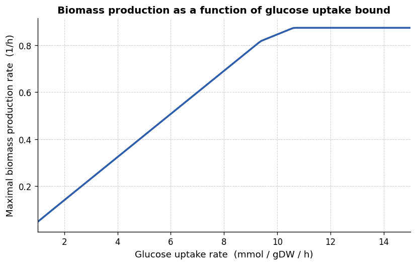
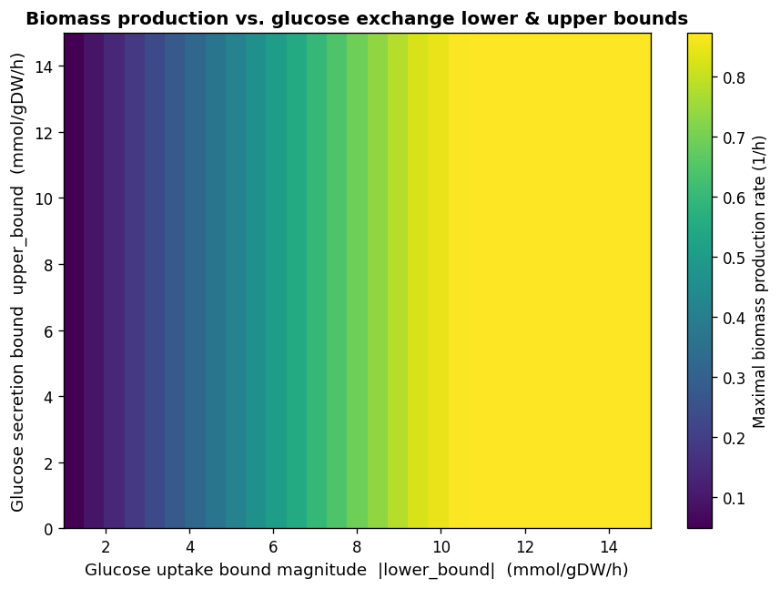

# Metabolic Modeling Assignment

**Course**: KEN3170 — Multi-scale modeling of biological systems
**Group number**: 3

---

## Repository overview
- `metabolic_analysis.ipynb` — main notebook containing all required code +answers
- `requirements.txt` — Python dependencies (cobra, pandas, csv)
- `README.md` — this file

**How to run**: [e.g. `pip install -r requirements.txt` then open and run `metabolic_analysis.ipynb` top to bottom]

---
## Q1: Flux Balance Analysis
a.)
After loading the provided reaction data into the Escher model, we came to this conclusion:

No, we do not observe the same thing. The reaction values in this dataset vary widely. These values range from 0.0 to 80.1 mmol/gDW/h. Unlike the linear pathway observed during the session, where mass balance forces have identical fluxes (v_1 = v_2), this metabolic network is more akin to a real metabolic network (extensive branching, loops, etc.).

b.)

The 2 different values observed are zero and no data (ND).
When a value is 0, it means that the reaction is present in the expression, however its maximal activity is 0. This is to show that the reaction has no available capacity.

## Q2: Establishing an enzyme activity-constrained metabolic model

The table we get is:
| Reaction | Lower bound | Upper bound |
|----------|------------:|------------:|
| PFK      | 0.0         | 13.1        |
| PFL      | 0.0         | 0.0         |
| PGI      | -11.1       | 11.1        |
| PGK      | -24.0       | 24.0        |
| PGL      | 0.0         | 7.3         |
| ...      | ...         | ...         |
| NADH16   | 0.0         | 40.1        |
| NADTRHD  | 0.0         | 1.3         |
| NH4t     | -1000.0     | 1000.0      |
| O2t      | -1000.0     | 1000.0      |
| PDH      | 0.0         | 26.6        |

For the full table please see the .ipynb file.

The ATPM line has the same lower bound as the practical and is: 
ATPM         8.39      1000.00

The EX_glc__D_e line reads as, using the default bounds from the practical: 
EX_glc__D_e     -1000.00      1000.00

## Q3: Flux Balance Analysis under glucose uptake constraints

a.)

```
Maximal Biomass Production Rate: 0.8733 mmol/gDW/h
```

**Explain what this constraint would describe in contrast to the expression-based constraints implemented in the rest of the model.**

Setting an absolute flux bound of 5 mmol/gDW/h on the glucose exchange reaction (EX_glc__D_e) restricts the rate at which the cell can take up external glucose. This specific constraint models factors such as nutrient availability and transporter capacity. In contrast, gene expression constraints limit how fast internal enzymes can work based on how much of each protein is available inside the cell, rather than focusing on outside nutrients.

b.)

```
Maximal Biomass Production Rate: 0.4156 mmol/gDW/h
```

**Using the new glucose bounds, explain any differences you observe in the predicted maximal biomass production rate.**

The biomass rate dropped from 0.8733 mmol/gDW/h to 0.4156 mmol/gDW/h. This is because tightening the glucose upper limit to 5 mmol/gDW/h restricted the cell's carbon and energy supply. This shows that glucose was the limiting nutrient, as the lower external supply was directly bottlenecking the maximal growth rate.

## Q4: Glucose uptake sensitivity and exchange reaction activation

### Part A

A plot was prepared of the maximal biomass production rate as a function of the glucose exchange reaction flux bound, scanning the uptake bound over the interval [1, 15] mmol/gDW/h in increments of 0.1 mmol/gDW/h.

```
First activated at glucose uptake = 9.40 mmol/gDW/h
Newly active exchange reaction(s): {'EX_ac_e': np.float64(0.05367170526640648)}
```



### Part B

**Does the growth rate increase indefinitely with increasing glucose exchange reaction flux bound?**

No, it maxes out at around 11 mmol/(gDW·h) of glucose intake. The biomass production rate increases linearly as glucose intake goes from 1 until around 9, when an increase in glucose results in a proportionally lower increase in biomass production rate. The relationship is still linear, but the slope is smaller in the interval around 9 to 11. Then at 11 there is a plateau as mentioned.

This is likely due to bottlenecks in the metabolic pathway. By looking at Escher, I...

### Part C

**At what glucose uptake rate does a new exchange reaction first become active, and which one?**

```
First activated at glucose uptake = 9.40 mmol/gDW/h
Newly active exchange reaction(s): {'EX_ac_e': np.float64(0.053671705266407514)}
```

### Bonus

Changing the glucose secretion bound (`upper_bound`) never changes the maximal biomass rate. The reason is that the optimiser will never pick a solution that secretes glucose, because doing so is suboptimal — so increasing the upper bound has no effect on the output.

A heatmap of biomass production as a function of both the glucose uptake bound (`|lower_bound|`) and the glucose secretion bound (`upper_bound`), varied independently, confirms this: biomass depends only on the uptake magnitude (x-axis) and is completely flat along the secretion-bound axis (y-axis).



---

## Conclusion

Across the four tasks, the *E. coli* core model behaved in ways that make biological sense once the constraints are considered together. The raw expression data (Q1) already hinted that this network is far from the simple linear pathway used in the practical session — reaction capacities vary over two orders of magnitude and several reactions are switched off entirely (0 mmol/gDW/h), reflecting genuine branching and regulation rather than a single forced flux.

Converting that expression data into flux bounds (Q2) and then constraining glucose uptake (Q3) showed that growth is highly sensitive to carbon availability: cutting the glucose bound from unconstrained to ±5 mmol/gDW/h roughly halved the maximal biomass production rate, confirming glucose as the limiting substrate under these conditions.

The uptake scan in Q4 filled in the full picture: growth scales close to linearly with glucose uptake up to a point, then the slope softens once acetate secretion (`EX_ac_e`) switches on around 9.4 mmol/gDW/h, and growth plateaus entirely beyond ~11 mmol/gDW/h once the rest of the network (respiration, cofactor turnover, etc.) becomes the binding constraint rather than carbon supply itself. This pattern is consistent with the acetate overflow behavior well documented for *E. coli* growing on excess glucose. Finally, the bonus heatmap made it clear that the model never "chooses" to waste glucose by secreting it back out — the secretion bound is simply irrelevant to the optimum, since FBA always finds the objective-maximizing solution and exporting substrate is never optimal.

Together, these results illustrate how flux balance analysis, combined with expression-derived flux bounds, can reveal both the limiting resource in a metabolic network and the points at which alternative pathways (like acetate excretion) become active as that resource becomes more available.
