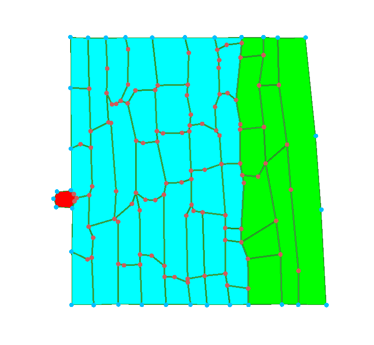
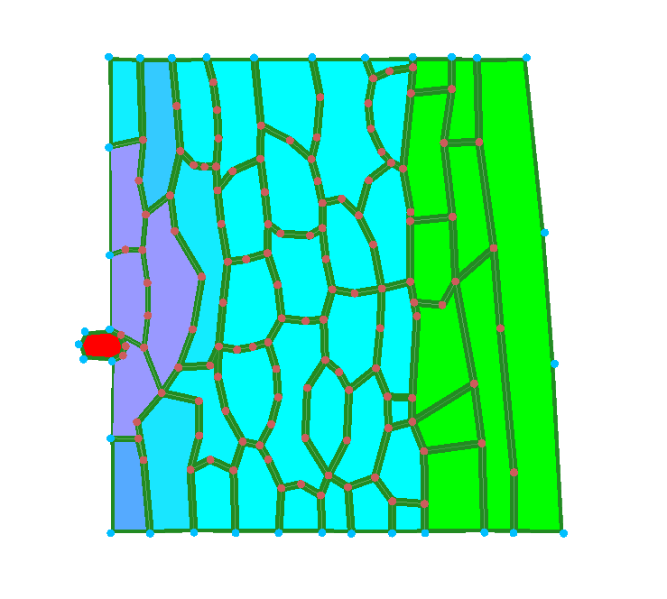
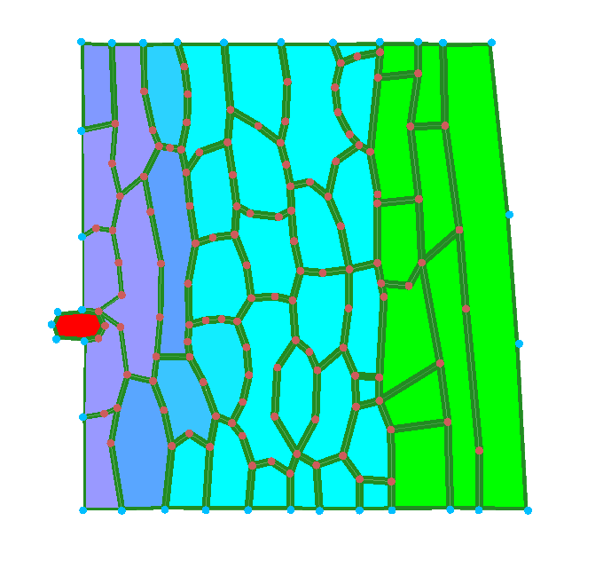
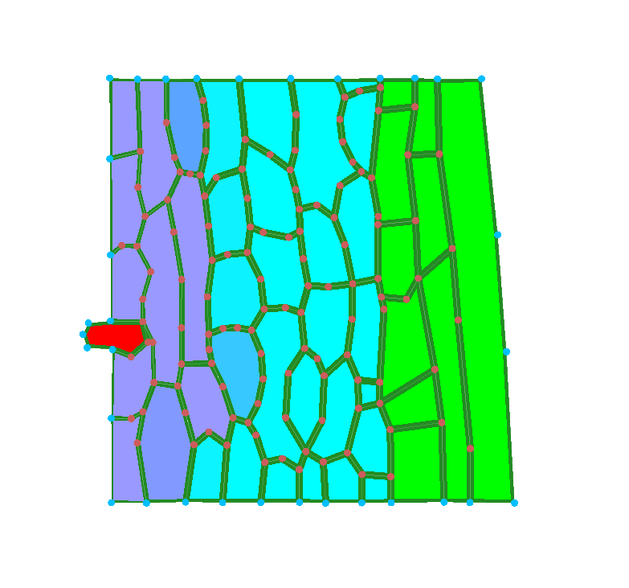
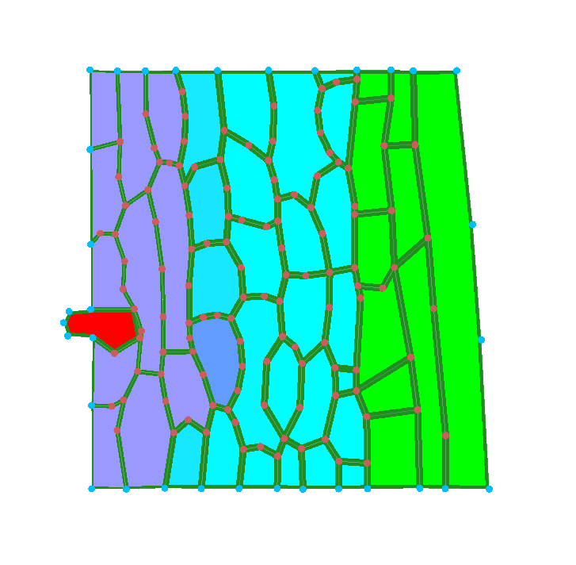
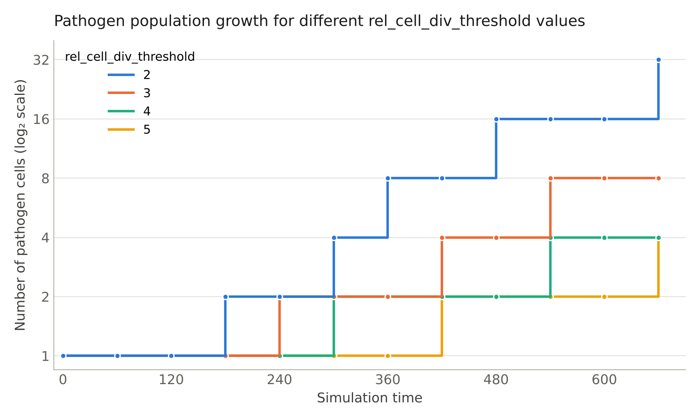

# Plant systems biology — Infection Analysis of Plant tissue

**Course**: KEN3170 — Multi-scale modeling of biological systems
**Group number**: 3

---

## 1. Repository overview
- `README.md` — this file

## Q1 — Initial Tissue Observations

| Initial | 30 min | 1 hr | 1 hr 30 min | 2 hr |
| :---: | :---: | :---: | :---: | :---: |
|  |  |  |  |  |

## Simulation Timeline

| Time | Observation |
| :--- | :--- |
| **Initial** | From observation alone, there are two distinct shades of plant tissue and some kind of cell emerging from the left side. Most cell walls are straight lines. |
| **30 min** | The red cell on the left has now started to infect the healthy plant tissue (cyan). The healthy plant tissue surrounding the infection source is now turning a light purple-ish hue. The red cell has not moved/is the same size compared to initial observations. All cells have deformed, not just the infiltrated ones, including the cells farthest from the infiltrated one that have not changed in colour. Most cell walls are not straight anymore. The total surface area of each cell looks to be roughly unchanged. The defortmities do not seem to expand radially outward from the infection source as might a shockwave, nor as a projectile-induced deformity. Rather the defortmities appear to be quite haphazard. The green xylem cells remain unchanged. |
| **1 hr** | The infection from the red cell has now mostly spread all the way to the sides of the tissue sample and infecting cells up to the 3rd layer. As the red cell moves its way into the tissue, it manipulates and distorts the cell walls of the plant tissue. The change between 0-30min is more drastic than between and 30-60min. The cells in direct contact with the infection source do not seem to be significantly smaller, though the infecting body takes up some space. The green xylem cells remain unchanged. |
| **1 hr 30 min** | The red cell is now pushing deeper into the tissue. More of the healthy tissue is being infected by the red cell, with the cell walls being distorted as the red cell pushes its way forward. The red infecting body has grown visibly larger now, it seems to have about doubled in size since the first frame. Despite this, it's hard to say if the cells directly in contact with the infecting body have shrunk in size. The infection seems to be contained to the third layer, the 4th layer seems largely unaffected, despite the third layer having solid purple colour. The green xylem cells remain unchanged.  |
| **2 hr** | The red cell continues to grow in size. The result of this growth is causing more distortions in the cell walls, and at the same time, more healthy tissue is being infected. The red infecting body has further increased in size. The cells directly touching the infecting body seem to have gotten smaller. The first cell in the 4th layer has now turned blueish, the centremost cell closest to the infection source. The green xylem cells remain unchanged. |

## Q2 — Function Analysis: `CellHouseKeeping`

### How is a cell's wall stiffness reduced as a function of its chemical level?

When the plant cell is healthy (chemical level near 0), the wall stiffness value remains at the maximum value of **3**. As the pathogen spreads, the wall stiffness is reduced. 

Based on the code snippet, because the chemical level is capped at **1.2**, the lowest the wall stiffness can drop to is **1.8**, which can be deduced using the reduction formula:

`stiffness_inf = 3 - (patho_chem_level)`

One might be tempted to think that low wall stiffness causes the walls stretch and distort, but this is not so. Low wall stiffness merely enables the distortion but does not cause it. The reason is that neighbouring cells that still have high wall rigidity do not push against weaker walls, precisely because they are rigid and cannot deform much.
The target area of the cells remains constant through the entire simulation, meaning all cells tend to maintain the same area through the entire simulation. Only the pathogen body changes its target area and grows. 
So while low wall stiffness enables deformation, it is only the infiltrating body that causes deformations as it takes up more space inside the cell and cells have to deform to make room for it, though the Hamiltonian term pushes back. Both turgor and wall stiffness play a role.  

### What does the pathogen do differently?

The pathogen differs from the regular plant cells because the code runs a check to see if it is Type 2. The pathogen is the source of the wall-weakening chemical, which is produced at a constant rate that depends on the initial chemical level. 
The pathogen itself is excluded from wall weakening. Because the pathogen remains rigid, with the ability to grow and split, it is able to consistently push into the plant tissue, whose wall is now weaker.
The infecting body's target area increases by 2 every step, unconditionally. That means that, if the Hamiltonian of the surrounding cells allows, the pathogen will keep increasing forever.

## Q3 — Function Analysis: `CellToCellTransport`

### How is the diffusion coefficient defined?

The diffusion coefficient is defined inversely proportional to the wall stiffness.
If the wall stiffness is greater than 0.001, the diffusion coefficient is calculated as:

`diffusionCoef = 0.00001 / stiffness`

If the stiffness drops to or below 0.001, it is capped at a maximum constant value:

`diffusionCoef = 0.00001`

Based on these values/observations, as the cell wall becomes softer, the diffusion coefficient increases, allowing the chemicals from the pathogen to pass through more easily.

### Diffusion Feedback. Is it a positive or negative feedback loop?

As defined in the function `CellToCellTransport`, this diffusion rate is directly correlated to how the chemical from the pathogen breaks down the cell walls, further spreading the infection.

The loop can be described as: **chemical lowers stiffness** --> **lower stiffness raises diffusion** --> **faster diffusion spreads the chemical**

This creates a **positive feedback loop**. Instead of stabilizing/counteracting the change, the increase in chemical levels triggers physical changes that amplify the spread of more chemicals through the tissue.

## Q4 — Effect of `rel_cell_div_threshold` on pathogen expansion

> Raise and lower `rel_cell_div_threshold`. How does it change how fast the pathogen population expands? Document two runs.

| `rel_cell_div_threshold` | 0 | 60 | 120 | 180 | 240 | 300 | 360 | 420 | 480 | 540 | 600 | 660 |
|---|---|---|---|---|---|---|---|---|---|---|---|---|
| **2** | 1 | 1 | 1 | 2 | 2 | 4 | 8 | 8 | 16 | 16 | 16 | 32 |
| **3** | 1 | 1 | 1 | 1 | 2 | 2 | 2 | 4 | 4 | 8 | 8 | 8 |
| **4** | 1 | 1 | 1 | 1 | 1 | 2 | 2 | 2 | 2 | 4 | 4 | 4 |
| **5** | 1 | 1 | 1 | 1 | 1 | 1 | 1 | 2 | 2 | 2 | 2 | 4 |



When `rel_cell_div_threshold` is lowered, the pathogen population expands faster. This is because the pathogen needs to grow less before reaching the condition required for cell division. Therefore, division occurs earlier and more frequently, as apposed to a higher `rel_cell_div_threshold`. For example, with a threshold of 2, the pathogen population reaches 32 cells by minute 660, whereas with a threshold of 5, only 4 cells are present at the same time. Increasing the threshold therefore delays each division and slows the overall growth of the pathogen population.

## Q5 — What is a fundamental difference regarding cell neighbours in this model compared to all other models that you have worked with so far?


In the previous models, a cell's neighbours were mostly fixed and only changed when a cell divided. In this infection model, however, the neighbour relationships can change during the simulation. The main difference is that cell topology is dynamic in this model: infection can cause cells to gain or lose neighbours through wall remodelling, rather than neighbour changes only occurring through cell division. This is simulated by changing `SetCellVeto()` to False, which allows the weakened, lower-stiffness walls to be remodelled, allowing the pathogen to get through the tissue and gain new neighbours.


## Q6 — The plant evolves a defense: cells above a chemical threshold stiffen their walls. Describe in pseudocode where in `CellHouseKeeping` this would go and what sign of feedback it adds. Do not implement it. Pseudocode for the different sections is enough!

**Plant defense**

The defense would be added in `CellHouseKeeping` , in the same section where the wall weakening currently happens.

```ccp
// defence
if cell is not a pathogen:

    if patho_chem_level > defense_threshold:
        // defense response
        increase stiffness above the normal value
        SetCellVeto(true)

    else if patho_chem_level > 0.1:
        // weakening response
        stiffness = 3 - patho_chem_level
        SetCellVeto(false)

    else:
        stiffness = 3
        SetCellVeto(true)

apply stiffness to all wall elements
```


The pseudo code would be added patho_chem_level is calculated and stiffness is set to 3.

In the original model: more chemical → lower stiffness → higher diffusion → faster chemical spread

With the defense, once the chemical concentration becomes high enough: more chemical → higher stiffness → lower diffusion → slower chemical spread

This opposes the spread of the pathogen chemical. `SetCellVeto(true)` would also prevent wall remodelling in defended cells.


